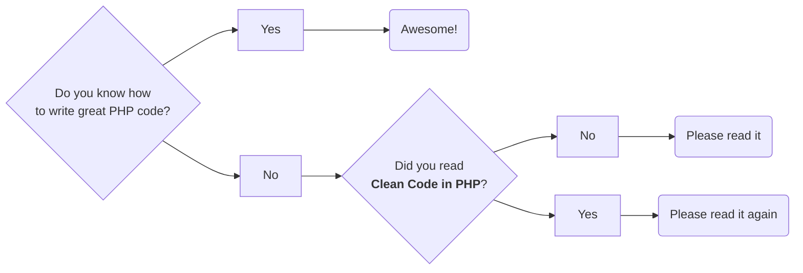

## Mermaid in Markdown documents

Mermaid diagrams can be written into a Markdown document.
If you Markdown viewer supports it, it will directly render the diagram inside the text.

```mermaid
graph LR
    A{Do you know how <br>to write great PHP code?} --> B[No]
    A --> C[Yes]
    C --> E(Awesome!)
    B --> D{Did you read <br /><strong>Clean Code in PHP</strong>?} --> F[No]
    D --> G[Yes]
    G --> H(Please read it again)
    F --> I(Please read it) 
```